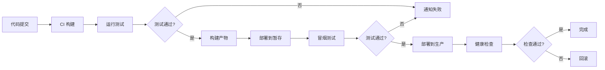

# 自动化部署 - 从代码到生产的完整流程

## 1. 自动化部署概述

### 1.1 什么是自动化部署

自动化部署是指使用自动化工具和脚本，将应用程序从开发环境自动发布到生产环境的过程。它是持续交付（CD）的核心组成部分。

**核心价值：**

- **提高效率**：消除手动部署的重复劳动
- **减少错误**：避免人为失误导致的部署问题
- **快速交付**：加速功能从开发到上线的速度
- **可回滚性**：支持快速回滚到之前的版本
- **标准化**：确保每次部署流程一致

### 1.2 部署策略

#### 蓝绿部署（Blue-Green Deployment）

```
生产环境（蓝）  ←  流量
  |
  |-- 切换流量 -->
  |
测试环境（绿）  ←  新版本
```

**优势：**
- 零停机时间
- 快速回滚
- 完整的测试环境

**劣势：**
- 需要双倍资源
- 数据同步复杂

#### 滚动部署（Rolling Deployment）

```
实例1  →  更新  →  完成
实例2  →  等待  →  更新  →  完成
实例3  →  等待  →  等待  →  更新  →  完成
```

**优势：**
- 资源利用高效
- 逐步更新，风险可控

**劣势：**
- 部署时间较长
- 回滚较复杂

#### 金丝雀部署（Canary Deployment）

```
新版本  →  10% 流量  →  监控  →  50% 流量  →  100% 流量
旧版本  ←  90% 流量  ←  监控  ←  50% 流量  ←  0% 流量
```

**优势：**
- 风险最小化
- 渐进式验证
- 实时监控

**劣势：**
- 配置复杂
- 需要流量管理

### 1.3 部署流程



## 2. GitHub Actions 自动化部署

### 2.1 基础部署配置

#### 部署到生产环境

```yaml
# .github/workflows/deploy.yml
name: Deploy to Production

on:
  push:
    branches:
      - main
  workflow_dispatch:
    inputs:
      environment:
        description: 'Deployment environment'
        required: true
        default: 'production'
        type: choice
        options:
          - staging
          - production

env:
  NODE_VERSION: 18

jobs:
  build:
    name: Build Application
    runs-on: ubuntu-latest
    
    steps:
      - name: Checkout code
        uses: actions/checkout@v4
      
      - name: Setup Node.js
        uses: actions/setup-node@v4
        with:
          node-version: ${{ env.NODE_VERSION }}
          cache: 'npm'
      
      - name: Install dependencies
        run: npm ci
      
      - name: Run tests
        run: npm test
      
      - name: Build application
        run: npm run build
        env:
          NODE_ENV: production
      
      - name: Upload build artifacts
        uses: actions/upload-artifact@v3
        with:
          name: build-${{ github.sha }}
          path: dist/
          retention-days: 7
  
  deploy:
    name: Deploy to ${{ github.event.inputs.environment || 'production' }}
    runs-on: ubuntu-latest
    needs: build
    environment:
      name: ${{ github.event.inputs.environment || 'production' }}
      url: ${{ steps.deploy.outputs.url }}
    
    steps:
      - name: Download build artifacts
        uses: actions/download-artifact@v3
        with:
          name: build-${{ github.sha }}
          path: dist/
      
      - name: Deploy application
        id: deploy
        run: |
          # 部署逻辑
          echo "url=https://myapp.com" >> $GITHUB_OUTPUT
```

### 2.2 多环境部署

```yaml
# .github/workflows/deploy-multi-env.yml
name: Multi-Environment Deployment

on:
  push:
    branches:
      - develop
      - staging
      - main

jobs:
  determine-environment:
    name: Determine Environment
    runs-on: ubuntu-latest
    outputs:
      environment: ${{ steps.env.outputs.environment }}
      url: ${{ steps.env.outputs.url }}
    
    steps:
      - name: Set environment based on branch
        id: env
        run: |
          if [[ "${{ github.ref }}" == "refs/heads/main" ]]; then
            echo "environment=production" >> $GITHUB_OUTPUT
            echo "url=https://app.example.com" >> $GITHUB_OUTPUT
          elif [[ "${{ github.ref }}" == "refs/heads/staging" ]]; then
            echo "environment=staging" >> $GITHUB_OUTPUT
            echo "url=https://staging.example.com" >> $GITHUB_OUTPUT
          else
            echo "environment=development" >> $GITHUB_OUTPUT
            echo "url=https://dev.example.com" >> $GITHUB_OUTPUT
          fi
  
  build:
    name: Build
    runs-on: ubuntu-latest
    needs: determine-environment
    
    steps:
      - uses: actions/checkout@v4
      
      - uses: actions/setup-node@v4
        with:
          node-version: 18
          cache: 'npm'
      
      - run: npm ci
      - run: npm test
      
      - name: Build for ${{ needs.determine-environment.outputs.environment }}
        run: npm run build
        env:
          VITE_API_URL: ${{ secrets[format('{0}_API_URL', needs.determine-environment.outputs.environment)] }}
          VITE_ENV: ${{ needs.determine-environment.outputs.environment }}
      
      - uses: actions/upload-artifact@v3
        with:
          name: build
          path: dist/
  
  deploy:
    name: Deploy to ${{ needs.determine-environment.outputs.environment }}
    runs-on: ubuntu-latest
    needs: [determine-environment, build]
    environment:
      name: ${{ needs.determine-environment.outputs.environment }}
      url: ${{ needs.determine-environment.outputs.url }}
    
    steps:
      - uses: actions/download-artifact@v3
        with:
          name: build
          path: dist/
      
      - name: Deploy
        run: |
          echo "Deploying to ${{ needs.determine-environment.outputs.environment }}"
          # 部署命令
```

### 2.3 带审批的部署流程

```yaml
# .github/workflows/deploy-with-approval.yml
name: Deploy with Approval

on:
  push:
    branches:
      - main

jobs:
  build:
    name: Build
    runs-on: ubuntu-latest
    
    steps:
      - uses: actions/checkout@v4
      - uses: actions/setup-node@v4
        with:
          node-version: 18
      - run: npm ci
      - run: npm run build
      
      - uses: actions/upload-artifact@v3
        with:
          name: build
          path: dist/
  
  deploy-staging:
    name: Deploy to Staging
    runs-on: ubuntu-latest
    needs: build
    environment:
      name: staging
      url: https://staging.example.com
    
    steps:
      - uses: actions/download-artifact@v3
        with:
          name: build
      
      - name: Deploy to staging
        run: |
          # 部署到 staging
          echo "Deployed to staging"
  
  smoke-test:
    name: Smoke Test
    runs-on: ubuntu-latest
    needs: deploy-staging
    
    steps:
      - uses: actions/checkout@v4
      
      - name: Run smoke tests
        run: |
          npm ci
          npm run test:smoke -- --env=staging
  
  deploy-production:
    name: Deploy to Production
    runs-on: ubuntu-latest
    needs: smoke-test
    environment:
      name: production
      url: https://example.com
    
    steps:
      - uses: actions/download-artifact@v3
        with:
          name: build
      
      - name: Deploy to production
        run: |
          # 部署到生产环境
          echo "Deployed to production"
      
      - name: Create deployment
        uses: actions/github-script@v7
        with:
          script: |
            github.rest.repos.createDeployment({
              owner: context.repo.owner,
              repo: context.repo.repo,
              ref: context.sha,
              environment: 'production',
              auto_merge: false
            })
```

## 3. 平台专属部署

### 3.1 Vercel 部署

#### 使用 Vercel CLI

```yaml
# .github/workflows/vercel-deploy.yml
name: Deploy to Vercel

on:
  push:
    branches: [main]

jobs:
  deploy:
    runs-on: ubuntu-latest
    
    steps:
      - uses: actions/checkout@v4
      
      - uses: actions/setup-node@v4
        with:
          node-version: 18
      
      - name: Install Vercel CLI
        run: npm install --global vercel@latest
      
      - name: Pull Vercel Environment
        run: vercel pull --yes --environment=production --token=${{ secrets.VERCEL_TOKEN }}
      
      - name: Build Project
        run: vercel build --prod --token=${{ secrets.VERCEL_TOKEN }}
      
      - name: Deploy to Vercel
        id: deploy
        run: |
          url=$(vercel deploy --prebuilt --prod --token=${{ secrets.VERCEL_TOKEN }})
          echo "url=$url" >> $GITHUB_OUTPUT
      
      - name: Comment PR with preview URL
        if: github.event_name == 'pull_request'
        uses: actions/github-script@v7
        with:
          script: |
            github.rest.issues.createComment({
              issue_number: context.issue.number,
              owner: context.repo.owner,
              repo: context.repo.repo,
              body: `✅ Preview deployed to: ${{ steps.deploy.outputs.url }}`
            })
```

#### 使用 Vercel Action

```yaml
# .github/workflows/vercel-action.yml
name: Vercel Deploy Action

on:
  push:
    branches: [main]
  pull_request:
    branches: [main]

jobs:
  deploy:
    runs-on: ubuntu-latest
    
    steps:
      - uses: actions/checkout@v4
      
      - name: Deploy to Vercel
        uses: amondnet/vercel-action@v25
        with:
          vercel-token: ${{ secrets.VERCEL_TOKEN }}
          vercel-org-id: ${{ secrets.VERCEL_ORG_ID }}
          vercel-project-id: ${{ secrets.VERCEL_PROJECT_ID }}
          vercel-args: ${{ github.event_name == 'push' && '--prod' || '' }}
```

### 3.2 Netlify 部署

```yaml
# .github/workflows/netlify-deploy.yml
name: Deploy to Netlify

on:
  push:
    branches: [main]
  pull_request:
    branches: [main]

jobs:
  deploy:
    runs-on: ubuntu-latest
    
    steps:
      - uses: actions/checkout@v4
      
      - uses: actions/setup-node@v4
        with:
          node-version: 18
      
      - run: npm ci
      - run: npm run build
      
      - name: Deploy to Netlify
        uses: nwtgck/actions-netlify@v2
        with:
          publish-dir: './dist'
          production-branch: main
          github-token: ${{ secrets.GITHUB_TOKEN }}
          deploy-message: 'Deploy from GitHub Actions'
          enable-pull-request-comment: true
          enable-commit-comment: true
          overwrites-pull-request-comment: true
        env:
          NETLIFY_AUTH_TOKEN: ${{ secrets.NETLIFY_AUTH_TOKEN }}
          NETLIFY_SITE_ID: ${{ secrets.NETLIFY_SITE_ID }}
        timeout-minutes: 10
```

### 3.3 AWS S3 + CloudFront 部署

```yaml
# .github/workflows/aws-deploy.yml
name: Deploy to AWS

on:
  push:
    branches: [main]

jobs:
  deploy:
    runs-on: ubuntu-latest
    
    steps:
      - uses: actions/checkout@v4
      
      - uses: actions/setup-node@v4
        with:
          node-version: 18
      
      - run: npm ci
      - run: npm run build
      
      - name: Configure AWS Credentials
        uses: aws-actions/configure-aws-credentials@v4
        with:
          aws-access-key-id: ${{ secrets.AWS_ACCESS_KEY_ID }}
          aws-secret-access-key: ${{ secrets.AWS_SECRET_ACCESS_KEY }}
          aws-region: us-east-1
      
      - name: Sync to S3
        run: |
          aws s3 sync dist/ s3://${{ secrets.AWS_S3_BUCKET }} \
            --delete \
            --cache-control "public, max-age=31536000, immutable" \
            --exclude "index.html" \
            --exclude "service-worker.js"
      
      - name: Upload index.html with no-cache
        run: |
          aws s3 cp dist/index.html s3://${{ secrets.AWS_S3_BUCKET }}/ \
            --cache-control "public, max-age=0, must-revalidate"
      
      - name: Invalidate CloudFront
        run: |
          aws cloudfront create-invalidation \
            --distribution-id ${{ secrets.CLOUDFRONT_DISTRIBUTION_ID }} \
            --paths "/*"
      
      - name: Wait for invalidation
        run: |
          invalidation_id=$(aws cloudfront create-invalidation \
            --distribution-id ${{ secrets.CLOUDFRONT_DISTRIBUTION_ID }} \
            --paths "/*" \
            --query 'Invalidation.Id' \
            --output text)
          
          aws cloudfront wait invalidation-completed \
            --distribution-id ${{ secrets.CLOUDFRONT_DISTRIBUTION_ID }} \
            --id $invalidation_id
```

### 3.4 Azure Static Web Apps

```yaml
# .github/workflows/azure-deploy.yml
name: Deploy to Azure

on:
  push:
    branches: [main]
  pull_request:
    types: [opened, synchronize, reopened, closed]
    branches: [main]

jobs:
  build_and_deploy:
    if: github.event_name == 'push' || (github.event_name == 'pull_request' && github.event.action != 'closed')
    runs-on: ubuntu-latest
    
    steps:
      - uses: actions/checkout@v4
        with:
          submodules: true
      
      - name: Build And Deploy
        uses: Azure/static-web-apps-deploy@v1
        with:
          azure_static_web_apps_api_token: ${{ secrets.AZURE_STATIC_WEB_APPS_API_TOKEN }}
          repo_token: ${{ secrets.GITHUB_TOKEN }}
          action: "upload"
          app_location: "/"
          api_location: ""
          output_location: "dist"
  
  close_pull_request:
    if: github.event_name == 'pull_request' && github.event.action == 'closed'
    runs-on: ubuntu-latest
    
    steps:
      - name: Close Pull Request
        uses: Azure/static-web-apps-deploy@v1
        with:
          azure_static_web_apps_api_token: ${{ secrets.AZURE_STATIC_WEB_APPS_API_TOKEN }}
          action: "close"
```

## 4. Docker 容器化部署

### 4.1 构建 Docker 镜像

#### Dockerfile

```dockerfile
# Dockerfile
# 多阶段构建
FROM node:18-alpine AS builder

WORKDIR /app

COPY package*.json ./
RUN npm ci

COPY . .
RUN npm run build

# 生产镜像
FROM nginx:alpine

COPY --from=builder /app/dist /usr/share/nginx/html
COPY nginx.conf /etc/nginx/nginx.conf

EXPOSE 80

CMD ["nginx", "-g", "daemon off;"]
```

#### Nginx 配置

```nginx
# nginx.conf
events {
  worker_connections 1024;
}

http {
  include /etc/nginx/mime.types;
  default_type application/octet-stream;

  sendfile on;
  keepalive_timeout 65;

  gzip on;
  gzip_vary on;
  gzip_types text/plain text/css application/json application/javascript text/xml application/xml application/xml+rss text/javascript;

  server {
    listen 80;
    server_name _;
    root /usr/share/nginx/html;
    index index.html;

    location / {
      try_files $uri $uri/ /index.html;
    }

    location /static {
      expires 1y;
      add_header Cache-Control "public, immutable";
    }

    location ~* \.(jpg|jpeg|png|gif|ico|css|js|svg|woff|woff2)$ {
      expires 1y;
      add_header Cache-Control "public, immutable";
    }
  }
}
```

### 4.2 GitHub Actions Docker 部署

```yaml
# .github/workflows/docker-deploy.yml
name: Docker Build and Deploy

on:
  push:
    branches: [main]
    tags: ['v*']

env:
  REGISTRY: ghcr.io
  IMAGE_NAME: ${{ github.repository }}

jobs:
  build-and-push:
    runs-on: ubuntu-latest
    permissions:
      contents: read
      packages: write
    
    steps:
      - uses: actions/checkout@v4
      
      - name: Set up Docker Buildx
        uses: docker/setup-buildx-action@v3
      
      - name: Log in to Container Registry
        uses: docker/login-action@v3
        with:
          registry: ${{ env.REGISTRY }}
          username: ${{ github.actor }}
          password: ${{ secrets.GITHUB_TOKEN }}
      
      - name: Extract metadata
        id: meta
        uses: docker/metadata-action@v5
        with:
          images: ${{ env.REGISTRY }}/${{ env.IMAGE_NAME }}
          tags: |
            type=ref,event=branch
            type=ref,event=pr
            type=semver,pattern={{version}}
            type=semver,pattern={{major}}.{{minor}}
            type=sha,prefix={{branch}}-
      
      - name: Build and push
        uses: docker/build-push-action@v5
        with:
          context: .
          platforms: linux/amd64,linux/arm64
          push: true
          tags: ${{ steps.meta.outputs.tags }}
          labels: ${{ steps.meta.outputs.labels }}
          cache-from: type=gha
          cache-to: type=gha,mode=max
  
  deploy:
    needs: build-and-push
    runs-on: ubuntu-latest
    
    steps:
      - name: Deploy to server
        uses: appleboy/ssh-action@v1.0.0
        with:
          host: ${{ secrets.SERVER_HOST }}
          username: ${{ secrets.SERVER_USER }}
          key: ${{ secrets.SSH_PRIVATE_KEY }}
          script: |
            docker pull ${{ env.REGISTRY }}/${{ env.IMAGE_NAME }}:main
            docker stop myapp || true
            docker rm myapp || true
            docker run -d \
              --name myapp \
              --restart unless-stopped \
              -p 80:80 \
              ${{ env.REGISTRY }}/${{ env.IMAGE_NAME }}:main
```

### 4.3 Docker Compose 部署

```yaml
# docker-compose.yml
version: '3.8'

services:
  app:
    image: ghcr.io/myorg/myapp:latest
    restart: unless-stopped
    ports:
      - "80:80"
    environment:
      - NODE_ENV=production
    networks:
      - app-network
    healthcheck:
      test: ["CMD", "curl", "-f", "http://localhost/health"]
      interval: 30s
      timeout: 10s
      retries: 3
      start_period: 40s

  nginx:
    image: nginx:alpine
    restart: unless-stopped
    ports:
      - "443:443"
    volumes:
      - ./nginx.conf:/etc/nginx/nginx.conf:ro
      - ./ssl:/etc/nginx/ssl:ro
    depends_on:
      - app
    networks:
      - app-network

networks:
  app-network:
    driver: bridge
```

```yaml
# .github/workflows/docker-compose-deploy.yml
name: Docker Compose Deploy

on:
  push:
    branches: [main]

jobs:
  deploy:
    runs-on: ubuntu-latest
    
    steps:
      - uses: actions/checkout@v4
      
      - name: Copy files to server
        uses: appleboy/scp-action@v0.1.4
        with:
          host: ${{ secrets.SERVER_HOST }}
          username: ${{ secrets.SERVER_USER }}
          key: ${{ secrets.SSH_PRIVATE_KEY }}
          source: "docker-compose.yml,nginx.conf"
          target: "/opt/myapp"
      
      - name: Deploy with Docker Compose
        uses: appleboy/ssh-action@v1.0.0
        with:
          host: ${{ secrets.SERVER_HOST }}
          username: ${{ secrets.SERVER_USER }}
          key: ${{ secrets.SSH_PRIVATE_KEY }}
          script: |
            cd /opt/myapp
            docker-compose pull
            docker-compose up -d
            docker-compose ps
```

## 5. Kubernetes 部署

### 5.1 Kubernetes 配置

#### Deployment

```yaml
# k8s/deployment.yml
apiVersion: apps/v1
kind: Deployment
metadata:
  name: myapp
  labels:
    app: myapp
spec:
  replicas: 3
  selector:
    matchLabels:
      app: myapp
  template:
    metadata:
      labels:
        app: myapp
    spec:
      containers:
      - name: myapp
        image: ghcr.io/myorg/myapp:latest
        ports:
        - containerPort: 80
        env:
        - name: NODE_ENV
          value: "production"
        resources:
          requests:
            memory: "128Mi"
            cpu: "100m"
          limits:
            memory: "256Mi"
            cpu: "200m"
        livenessProbe:
          httpGet:
            path: /health
            port: 80
          initialDelaySeconds: 30
          periodSeconds: 10
        readinessProbe:
          httpGet:
            path: /ready
            port: 80
          initialDelaySeconds: 5
          periodSeconds: 5
```

#### Service

```yaml
# k8s/service.yml
apiVersion: v1
kind: Service
metadata:
  name: myapp-service
spec:
  selector:
    app: myapp
  ports:
  - protocol: TCP
    port: 80
    targetPort: 80
  type: LoadBalancer
```

#### Ingress

```yaml
# k8s/ingress.yml
apiVersion: networking.k8s.io/v1
kind: Ingress
metadata:
  name: myapp-ingress
  annotations:
    kubernetes.io/ingress.class: nginx
    cert-manager.io/cluster-issuer: letsencrypt-prod
spec:
  tls:
  - hosts:
    - myapp.example.com
    secretName: myapp-tls
  rules:
  - host: myapp.example.com
    http:
      paths:
      - path: /
        pathType: Prefix
        backend:
          service:
            name: myapp-service
            port:
              number: 80
```

### 5.2 GitHub Actions Kubernetes 部署

```yaml
# .github/workflows/k8s-deploy.yml
name: Deploy to Kubernetes

on:
  push:
    branches: [main]

jobs:
  build-and-push:
    runs-on: ubuntu-latest
    
    steps:
      - uses: actions/checkout@v4
      
      - uses: docker/setup-buildx-action@v3
      
      - uses: docker/login-action@v3
        with:
          registry: ghcr.io
          username: ${{ github.actor }}
          password: ${{ secrets.GITHUB_TOKEN }}
      
      - uses: docker/build-push-action@v5
        with:
          context: .
          push: true
          tags: ghcr.io/${{ github.repository }}:${{ github.sha }}
  
  deploy:
    needs: build-and-push
    runs-on: ubuntu-latest
    
    steps:
      - uses: actions/checkout@v4
      
      - name: Configure kubectl
        uses: azure/k8s-set-context@v3
        with:
          method: kubeconfig
          kubeconfig: ${{ secrets.KUBE_CONFIG }}
      
      - name: Update deployment image
        run: |
          kubectl set image deployment/myapp \
            myapp=ghcr.io/${{ github.repository }}:${{ github.sha }} \
            --record
      
      - name: Wait for rollout
        run: |
          kubectl rollout status deployment/myapp
      
      - name: Verify deployment
        run: |
          kubectl get pods -l app=myapp
          kubectl get services myapp-service
```

### 5.3 使用 Helm

#### Helm Chart

```yaml
# helm/Chart.yaml
apiVersion: v2
name: myapp
description: My React Application
type: application
version: 1.0.0
appVersion: "1.0.0"
```

```yaml
# helm/values.yaml
replicaCount: 3

image:
  repository: ghcr.io/myorg/myapp
  tag: latest
  pullPolicy: IfNotPresent

service:
  type: LoadBalancer
  port: 80

ingress:
  enabled: true
  className: nginx
  annotations:
    cert-manager.io/cluster-issuer: letsencrypt-prod
  hosts:
    - host: myapp.example.com
      paths:
        - path: /
          pathType: Prefix
  tls:
    - secretName: myapp-tls
      hosts:
        - myapp.example.com

resources:
  requests:
    memory: "128Mi"
    cpu: "100m"
  limits:
    memory: "256Mi"
    cpu: "200m"

autoscaling:
  enabled: true
  minReplicas: 2
  maxReplicas: 10
  targetCPUUtilizationPercentage: 80
```

```yaml
# .github/workflows/helm-deploy.yml
name: Helm Deploy

on:
  push:
    branches: [main]

jobs:
  deploy:
    runs-on: ubuntu-latest
    
    steps:
      - uses: actions/checkout@v4
      
      - name: Install Helm
        uses: azure/setup-helm@v3
        with:
          version: '3.12.0'
      
      - uses: azure/k8s-set-context@v3
        with:
          method: kubeconfig
          kubeconfig: ${{ secrets.KUBE_CONFIG }}
      
      - name: Deploy with Helm
        run: |
          helm upgrade --install myapp ./helm \
            --set image.tag=${{ github.sha }} \
            --namespace production \
            --create-namespace \
            --wait \
            --timeout 5m
```

## 6. 零停机部署

### 6.1 健康检查配置

```typescript
// src/health.ts
import express from 'express';

const app = express();

// 存活探针
app.get('/health', (req, res) => {
  res.status(200).json({ status: 'ok' });
});

// 就绪探针
app.get('/ready', async (req, res) => {
  try {
    // 检查数据库连接
    await database.ping();
    
    // 检查关键服务
    await Promise.all([
      checkRedis(),
      checkExternalAPI()
    ]);
    
    res.status(200).json({ status: 'ready' });
  } catch (error) {
    res.status(503).json({ status: 'not ready', error });
  }
});

export default app;
```

### 6.2 优雅关闭

```typescript
// src/server.ts
import express from 'express';
import http from 'http';

const app = express();
const server = http.createServer(app);

// 优雅关闭处理
const gracefulShutdown = async () => {
  console.log('Received shutdown signal');
  
  // 停止接受新连接
  server.close(() => {
    console.log('HTTP server closed');
  });
  
  // 等待现有请求完成
  await new Promise(resolve => {
    setTimeout(resolve, 10000); // 10秒超时
  });
  
  // 关闭数据库连接
  await database.close();
  
  // 关闭其他资源
  await redis.quit();
  
  console.log('Graceful shutdown completed');
  process.exit(0);
};

// 监听终止信号
process.on('SIGTERM', gracefulShutdown);
process.on('SIGINT', gracefulShutdown);

server.listen(3000, () => {
  console.log('Server running on port 3000');
});
```

### 6.3 滚动更新策略

```yaml
# k8s/deployment.yml
apiVersion: apps/v1
kind: Deployment
metadata:
  name: myapp
spec:
  replicas: 5
  strategy:
    type: RollingUpdate
    rollingUpdate:
      maxSurge: 1          # 最多增加1个Pod
      maxUnavailable: 0    # 保证始终可用
  minReadySeconds: 30      # Pod就绪后等待30秒
  progressDeadlineSeconds: 600  # 10分钟超时
  template:
    spec:
      containers:
      - name: myapp
        image: myapp:latest
        lifecycle:
          preStop:
            exec:
              command: ["/bin/sh", "-c", "sleep 15"]
        terminationGracePeriodSeconds: 30
```

## 7. 回滚机制

### 7.1 自动回滚配置

```yaml
# .github/workflows/deploy-with-rollback.yml
name: Deploy with Auto Rollback

on:
  push:
    branches: [main]

jobs:
  deploy:
    runs-on: ubuntu-latest
    
    steps:
      - uses: actions/checkout@v4
      
      - name: Deploy new version
        id: deploy
        run: |
          # 部署新版本
          ./deploy.sh
          echo "deployment_id=$(date +%s)" >> $GITHUB_OUTPUT
      
      - name: Wait for deployment
        run: sleep 60
      
      - name: Health check
        id: health
        run: |
          for i in {1..5}; do
            if curl -f https://myapp.com/health; then
              echo "healthy=true" >> $GITHUB_OUTPUT
              exit 0
            fi
            sleep 10
          done
          echo "healthy=false" >> $GITHUB_OUTPUT
          exit 1
        continue-on-error: true
      
      - name: Rollback on failure
        if: steps.health.outputs.healthy != 'true'
        run: |
          echo "Health check failed, rolling back..."
          ./rollback.sh ${{ steps.deploy.outputs.deployment_id }}
          exit 1
```

### 7.2 Kubernetes 回滚

```bash
# 查看部署历史
kubectl rollout history deployment/myapp

# 回滚到上一个版本
kubectl rollout undo deployment/myapp

# 回滚到指定版本
kubectl rollout undo deployment/myapp --to-revision=3

# 检查回滚状态
kubectl rollout status deployment/myapp
```

```yaml
# .github/workflows/k8s-rollback.yml
name: Kubernetes Rollback

on:
  workflow_dispatch:
    inputs:
      revision:
        description: 'Revision to rollback to (empty for previous)'
        required: false

jobs:
  rollback:
    runs-on: ubuntu-latest
    
    steps:
      - uses: azure/k8s-set-context@v3
        with:
          method: kubeconfig
          kubeconfig: ${{ secrets.KUBE_CONFIG }}
      
      - name: Rollback deployment
        run: |
          if [ -n "${{ github.event.inputs.revision }}" ]; then
            kubectl rollout undo deployment/myapp --to-revision=${{ github.event.inputs.revision }}
          else
            kubectl rollout undo deployment/myapp
          fi
      
      - name: Wait for rollback
        run: |
          kubectl rollout status deployment/myapp --timeout=5m
      
      - name: Verify rollback
        run: |
          kubectl get pods -l app=myapp
          kubectl describe deployment myapp
```

## 8. 监控与告警

### 8.1 部署监控

```yaml
# .github/workflows/deploy-with-monitoring.yml
name: Deploy with Monitoring

on:
  push:
    branches: [main]

jobs:
  deploy:
    runs-on: ubuntu-latest
    
    steps:
      - uses: actions/checkout@v4
      
      - name: Deploy
        id: deploy
        run: ./deploy.sh
      
      - name: Monitor deployment
        run: |
          # 发送部署开始事件到监控系统
          curl -X POST https://monitoring.example.com/events \
            -H "Content-Type: application/json" \
            -d '{
              "type": "deployment_started",
              "app": "myapp",
              "version": "${{ github.sha }}",
              "timestamp": "'$(date -Iseconds)'"
            }'
      
      - name: Check metrics
        run: |
          sleep 120  # 等待2分钟收集指标
          
          # 检查错误率
          error_rate=$(curl -s https://monitoring.example.com/api/metrics?app=myapp&metric=error_rate)
          
          if (( $(echo "$error_rate > 0.05" | bc -l) )); then
            echo "Error rate too high: $error_rate"
            exit 1
          fi
      
      - name: Notify on failure
        if: failure()
        uses: slackapi/slack-github-action@v1
        with:
          webhook-url: ${{ secrets.SLACK_WEBHOOK }}
          payload: |
            {
              "text": "❌ Deployment failed for myapp",
              "blocks": [
                {
                  "type": "section",
                  "text": {
                    "type": "mrkdwn",
                    "text": "*Deployment Failed*\nApp: myapp\nCommit: ${{ github.sha }}\nBranch: ${{ github.ref_name }}"
                  }
                }
              ]
            }
```

### 8.2 告警集成

```yaml
# .github/workflows/alert.yml
name: Deployment Alert

on:
  workflow_run:
    workflows: ["Deploy to Production"]
    types:
      - completed

jobs:
  alert:
    runs-on: ubuntu-latest
    
    steps:
      - name: Deployment Success
        if: ${{ github.event.workflow_run.conclusion == 'success' }}
        run: |
          curl -X POST ${{ secrets.WEBHOOK_URL }} \
            -H 'Content-Type: application/json' \
            -d '{
              "status": "success",
              "message": "Deployment completed successfully",
              "commit": "${{ github.sha }}",
              "url": "${{ github.event.workflow_run.html_url }}"
            }'
      
      - name: Deployment Failure
        if: ${{ github.event.workflow_run.conclusion == 'failure' }}
        run: |
          curl -X POST ${{ secrets.WEBHOOK_URL }} \
            -H 'Content-Type: application/json' \
            -d '{
              "status": "failure",
              "message": "Deployment failed",
              "commit": "${{ github.sha }}",
              "url": "${{ github.event.workflow_run.html_url }}"
            }'
```

## 9. 最佳实践

### 9.1 部署清单

**部署前检查：**

- [ ] 代码已通过所有测试
- [ ] 代码已通过 code review
- [ ] 依赖版本已锁定
- [ ] 环境变量已配置
- [ ] 数据库迁移已准备
- [ ] 回滚计划已制定

**部署中监控：**

- [ ] 实时监控错误率
- [ ] 检查响应时间
- [ ] 观察资源使用
- [ ] 验证日志输出

**部署后验证：**

- [ ] 健康检查通过
- [ ] 冒烟测试通过
- [ ] 关键功能验证
- [ ] 性能指标正常

### 9.2 环境变量管理

```yaml
# .github/workflows/env-management.yml
name: Environment Management

on:
  workflow_dispatch:
    inputs:
      environment:
        type: choice
        options:
          - development
          - staging
          - production

jobs:
  deploy:
    runs-on: ubuntu-latest
    environment: ${{ github.event.inputs.environment }}
    
    steps:
      - uses: actions/checkout@v4
      
      - name: Create .env file
        run: |
          cat > .env << EOF
          NODE_ENV=${{ github.event.inputs.environment }}
          API_URL=${{ secrets.API_URL }}
          DATABASE_URL=${{ secrets.DATABASE_URL }}
          REDIS_URL=${{ secrets.REDIS_URL }}
          JWT_SECRET=${{ secrets.JWT_SECRET }}
          EOF
      
      - name: Build with environment
        run: |
          npm ci
          npm run build
```

### 9.3 版本标记

```yaml
# .github/workflows/versioning.yml
name: Version and Deploy

on:
  push:
    tags:
      - 'v*'

jobs:
  deploy:
    runs-on: ubuntu-latest
    
    steps:
      - uses: actions/checkout@v4
      
      - name: Get version
        id: version
        run: |
          echo "version=${GITHUB_REF#refs/tags/v}" >> $GITHUB_OUTPUT
      
      - name: Build with version
        run: |
          npm ci
          npm run build
        env:
          VITE_APP_VERSION: ${{ steps.version.outputs.version }}
      
      - name: Create release
        uses: softprops/action-gh-release@v1
        with:
          files: dist/**
          generate_release_notes: true
```

## 10. 总结

自动化部署是现代软件交付的核心，通过：

1. **标准化流程**：确保每次部署一致可靠
2. **自动化测试**：在部署前发现问题
3. **零停机部署**：保证服务连续性
4. **快速回滚**：出现问题时快速恢复
5. **完善监控**：实时掌握部署状态

通过合理的部署策略和工具链，可以实现快速、安全、可靠的持续交付。

